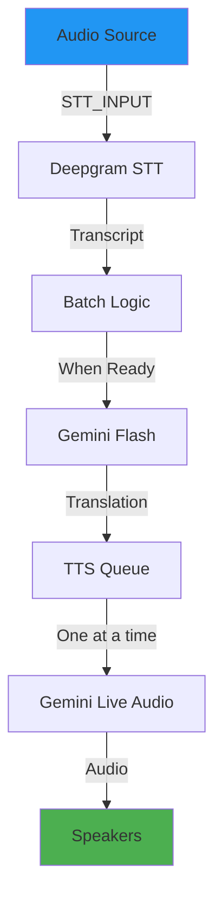

# Eburon Live Translation System - Architecture

## Overview

Real-time translation pipeline that transcribes live audio, translates it, and reads the translation aloud.



---

## Key Components

| Component | Tech | File |
|-----------|------|------|
| STT | Deepgram Nova-2 | `/api/transcription` |
| Translate | Gemini Flash | `/api/translate` |
| TTS | Gemini Live Audio | `/api/tts` |
| Queue | Custom FIFO | `lib/tts-queue.ts` |

---

## Audio Separation (Critical)

> [!CAUTION]
> TTS output must NEVER be fed back into STT input. This causes infinite feedback loops.

| Audio Path | Device | Purpose |
|------------|--------|---------|
| STT_INPUT | Mic/System Capture | Transcription source |
| TTS_OUTPUT | Speakers/Headphones | Plays translations |

**Rules:**
1. `/api/transcription` only receives STT_INPUT audio
2. TTS audio plays via separate output device
3. `config/audio.ts` validates device separation

---

## TTS Queue Behavior

**"Send next only after finish"**

```
┌─────────────┐    ┌─────────────┐    ┌─────────────┐
│  Segment 1  │ -> │  Segment 2  │ -> │  Segment 3  │
└─────────────┘    └─────────────┘    └─────────────┘
      ▲
      │ isSpeaking = true
      │ (blocks new segments)
```

- One TTS at a time per user/language
- New segments queue, wait their turn
- `isSpeaking` guard prevents overlap

---

## API Endpoints

| Endpoint | Method | Input | Output |
|----------|--------|-------|--------|
| `/api/transcription` | POST | Audio blob | Transcript |
| `/api/translate` | POST | Text, language | Translation |
| `/api/tts` | POST | Text, language | Audio WAV |

---

## Quick Start

```bash
# Install dependencies
npm install

# Set environment variables
cp .env.example .env.local
# Edit .env.local with your API keys

# Run dev server
npm run dev:all
```

---

## Environment Variables

| Key | Required | Description |
|-----|----------|-------------|
| `DEEPGRAM_API_KEY` | Yes | Deepgram STT |
| `GEMINI_API_KEY` | Yes | Gemini Flash/Live |
| `NEXT_PUBLIC_SUPABASE_URL` | Yes | Supabase URL |
| `NEXT_PUBLIC_SUPABASE_ANON_KEY` | Yes | Supabase key |
| `STT_INPUT_DEVICE_ID` | No | Audio input device |
| `TTS_OUTPUT_DEVICE_ID` | No | Audio output device |
